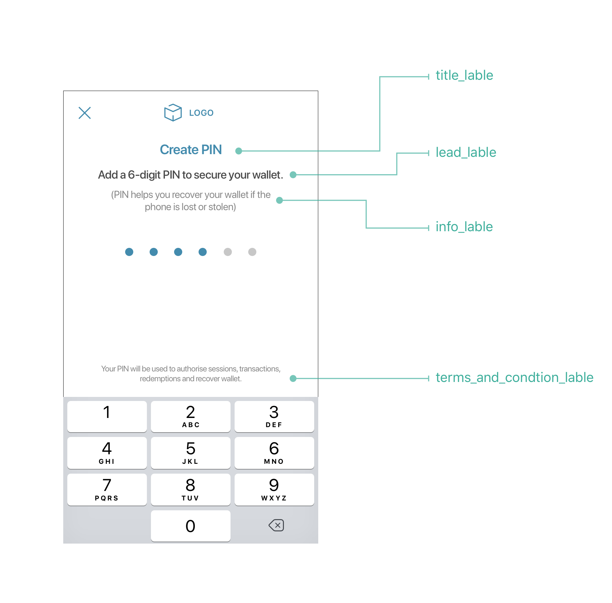
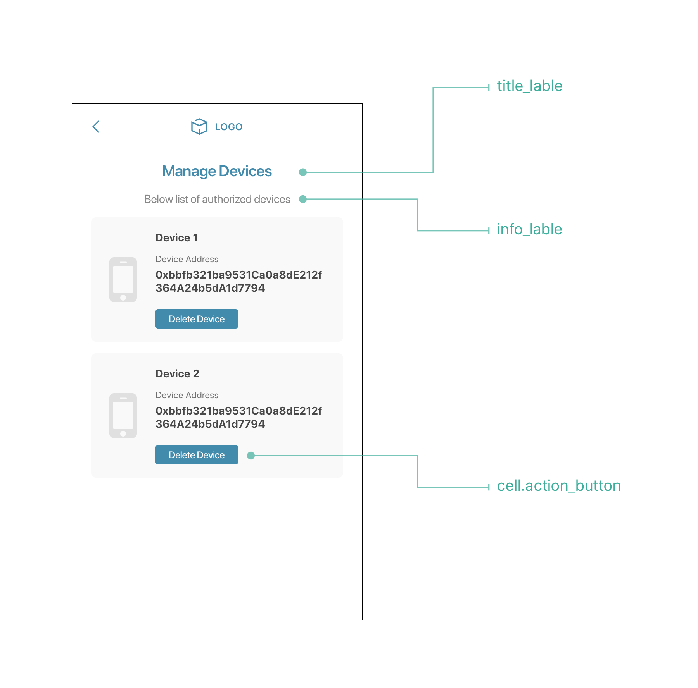
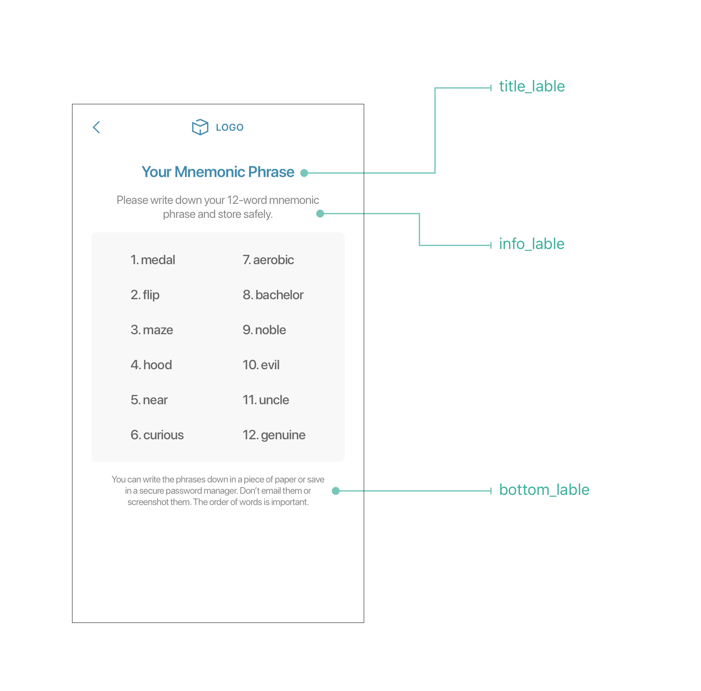
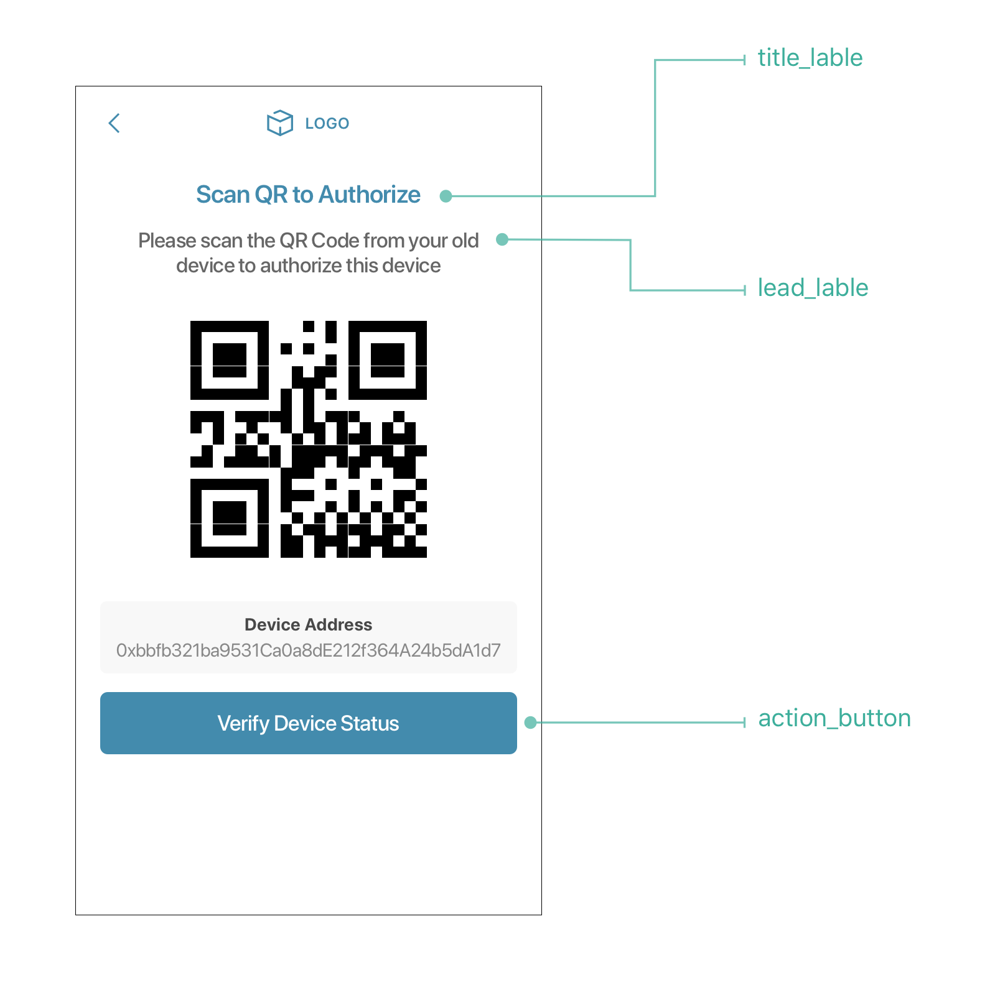
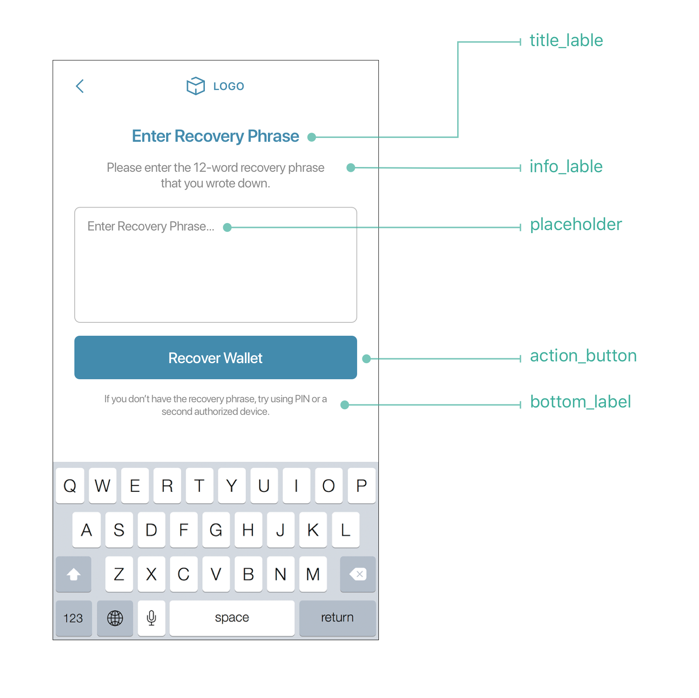
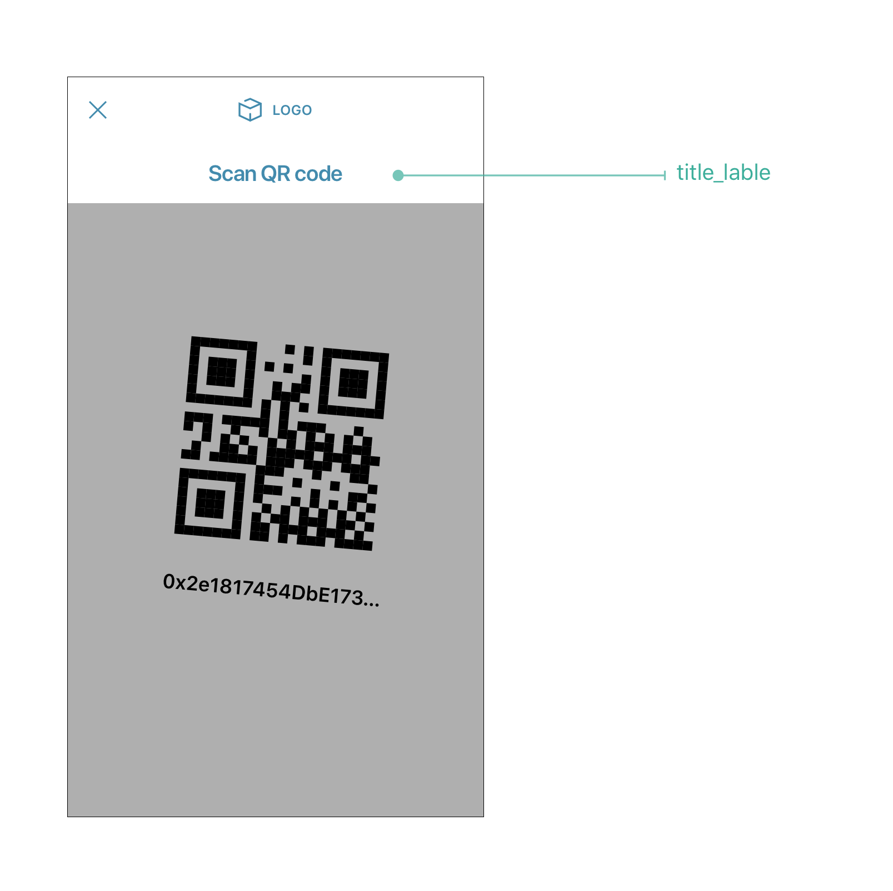
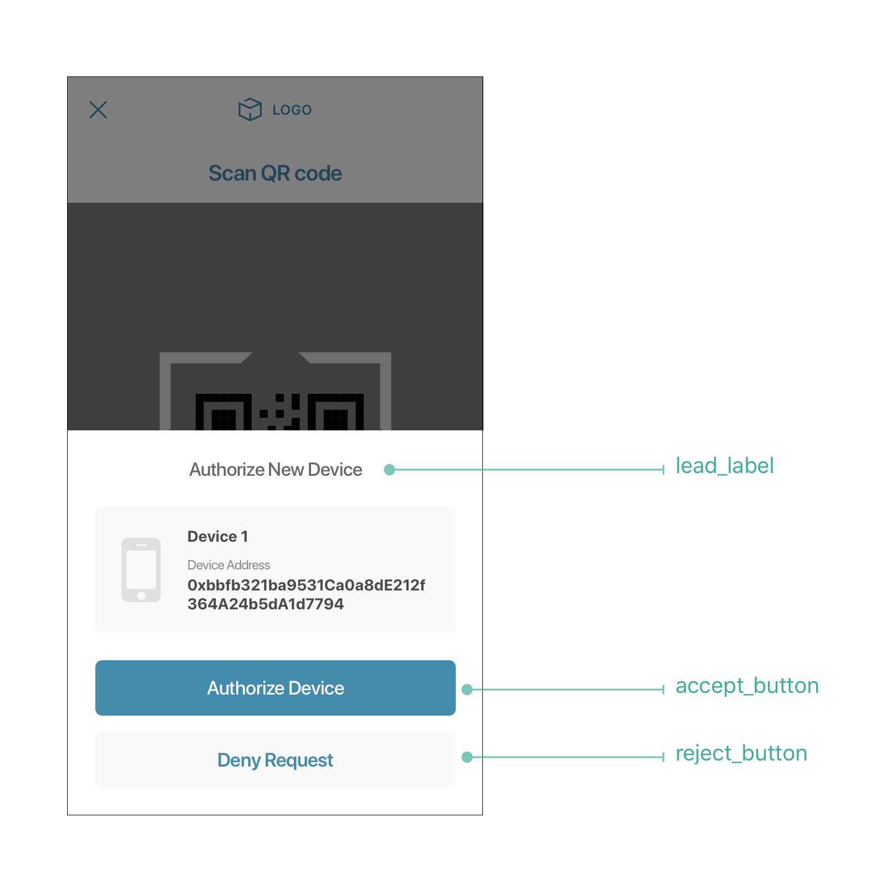
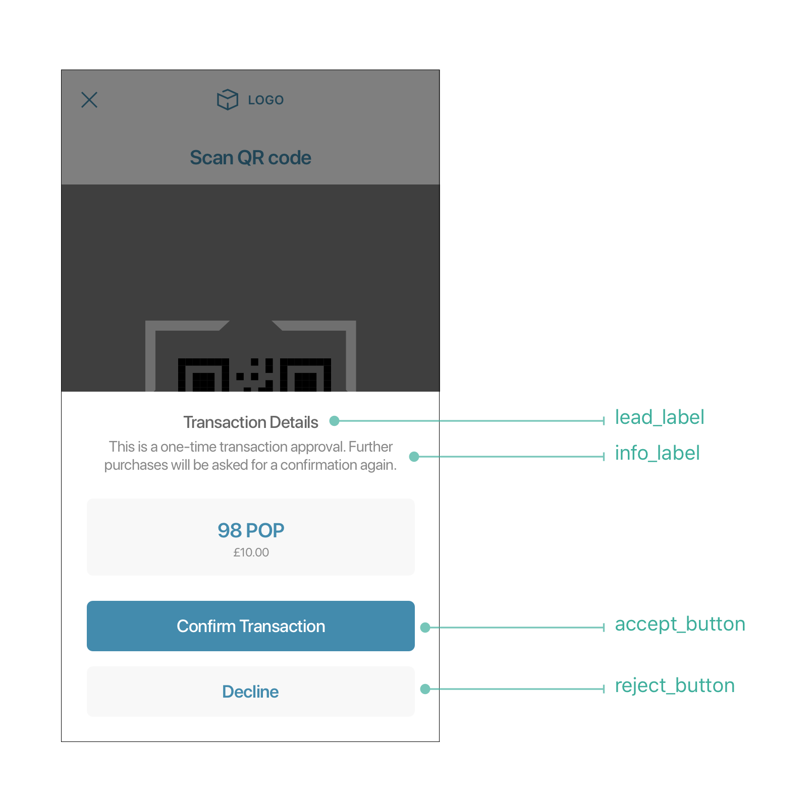

# OST Wallet UI Content Config
App developers can configure the text shown on various views displayed by OstWalletUI.

To configure the content, the sdk needs to be provided with [`JSON`](https://developer.android.com/reference/org/json/JSONObject).

The default configuration can be found [here](../ostsdk/src/main/assets/ost-content-config.json).

## Dictionary Data Structure
Here is the small sample `json` representation of the configuration.
```js
{
  "activate_user": {
    "create_pin": {
      "title_label": {
        "text": "Activate Your Wallet"
      }
    }
  }
}
```

In the above example:
* The first-level key `activate_user` corresponds to `Activate User` workflow.
* The second-level key `create_pin` corresponds to `Create Pin` view.
* The third-level key `title_label` corresponds to label that displays the title of the view.
* The fourth-level key `text` is corresponds to diplay text to the title label.

## Supported Workflows
OstWalletUI supports 8 workflows

| Configuration Keys   | Workflows                   |
| -------------------- |:---------------------------:|
| activate_user        | Activate User               |
| add_session          | Add Session                 |
| initiate_recovery    | Initialize Recovery         |
| abort_recovery       | Abort Device Recovery       |
| revoke_device        | Revoke Device               |
| biometric_preference | Update Biometric Preference |
| reset_pin            | Reset a User's PIN          |
| view_mnemonics       | Get Mnemonic Phrase         |
| show_add_device_qr   | Get current Device QR code  |
| add_current_device_with_mnemonics     | Authorize device using mnemonics   |
| scan_qr_to_authorize_device           | Authorize device by scanning QR    |
| scan_qr_to_execute_transaction        | Execute transaction by scanning QR |

## Supported Views
### Activate User Workflow Views

| Configuration Keys   | Views                                                       |
| -------------------- | ----------------------------------------------------------- |
| create_pin           | Create Pin View where user sets the pin for first time      |
| confirm_pin          | Confirm Pin View where user confirms the pin again          |

### Add Session Views

| Configuration Keys   | Views                                                      |
| -------------------- | ---------------------------------------------------------- |
| get_pin              | Get Pin View where user provides pin for authentication    |

### Initialize Recovery Views

| Configuration Keys   | Views                                                       |
| -------------------- | ----------------------------------------------------------- |
| device_list          | Displays list of authorized devices for user to choose from |
| get_pin              | Get Pin View where user provides pin for authentication     |


### Abort Device Recovery Views

| Configuration Keys   | Views                                                      |
| -------------------- | ---------------------------------------------------------- |
| get_pin              | Get Pin View where user provides pin for authentication    |

### Revoke Device Views

| Configuration Keys   | Views                                                       |
| -------------------- | ----------------------------------------------------------- |
| device_list          | Displays list of authorized devices for user to choose from |
| get_pin              | Get Pin View where user provides pin for authentication     |

### Update Biometric Preferences Views

| Configuration Keys   | Views                                                      |
| -------------------- | ---------------------------------------------------------- |
| get_pin              | Get Pin View where user provides pin for authentication    |

### Reset a User's PIN Views

| Configuration Keys   | Views                                                      |
| -------------------- | ---------------------------------------------------------- |
| get_pin              | Get Pin View where user provides current pin               |
| set_new_pin          | View where user sets the new pin                           |
| confirm_new_pin      | Confirm Pin View where user confirms the new pin again     |

### Get Mnemonic Phrase Views

| Configuration Keys   | Views                                                      |
| -------------------- | ---------------------------------------------------------- |
| get_pin              | Get Pin View where user provides pin for authentication    |
| show_mnemonics       | Displays 12 word mnemonics of device                       |

### Show Add Device QR View

| Configuration Keys   | Views                                                      |
| -------------------- | ---------------------------------------------------------- |
| show_qr              | Displays QR code of device                                 |

### Add Current Device With Mnemonics Views

| Configuration Keys   | Views                                                      |
| -------------------- | ---------------------------------------------------------- |
| provide_mnemonics    | Display View to get 12 word mnemonics from user            |
| get_pin              | Get Pin View where user provides pin for authentication    |

### Authorize Device Via QR Views

| Configuration Keys   | Views                                                      |
| -------------------- | ---------------------------------------------------------- |
| scan_qr              | View to scan Device QR                                     |
| verify_device        | View which displays Device data to be verified             |
| get_pin              | Get Pin View where user provides pin for authentication    |


### Execute Transaction Via QR Views

| Configuration Keys   | Views                                                      |
| -------------------- | ---------------------------------------------------------- |
| scan_qr              | View to scan Transaction QR                                |
| verify_transaction   | View which displays Transaction data to be verified        |
| get_pin              | Get Pin View where user provides pin for authentication    |

## Loader Content View Components
In every workflow we support two loaders with text configuration:
* initial_loader</br>
Loader shown before workflow request construct
* loader</br>
Loader shown after workflow request construct

## Supported UI Components in PIN Input Views
Here, we refer follwing views as 'Pin Input' views:
* create_pin
* confirm_pin
* get_pin
* set_new_pin
* confirm_new_pin

The following UI components are supported by PIN Input views.

| Configuration Keys        | Component Type |
| ------------------------- |:--------------:|
| title_label               | label          |
| lead_label                | label          |
| info_label                | label          |
| terms_and_condition_label | label          |

Here is an example of what the PIN Input View looks like:



### Adding links to `terms_and_condition_label`
`terms_and_condition_label` is a special label that supports inline links using `placeholder` within the text.

Below is a sample configuration to achive the same:
```js
{
  "activate_user": {
    "create_pin": {
      "terms_and_condition_label": {
        "text": "Please refer our {{t_and_c}} and {{privacy_policy}}"
      },
      "placeholders": {
        "t_and_c": {
          "url": "https://ost.com/terms",
          "text": "Terms and Conditions",
          "color": "#0076FF"
        },
        "privacy_policy": {
          "url": "https://ost.com/privacy",
          "text": "Privacy Policy",
          "color": "#0076FF"
        }
      }
    }
  }
}
```
#### NOTE
```
As of now, `placeholder` is only applicable to `terms_and_condition_label`
and is NOT supported by other labels.
```

## Supported UI Components in Device List Views (device_list)

The following UI components are supported by Device List Views.

| Configuration Keys        | Component Type |
| ------------------------- |:--------------:|
| title_label               | label          |
| info_label                | label          |
| action_button             | button text    |

Here is an example fo what the Device List View looks like:



## Supported UI Components in Show Mnemonics Views(show_mnemonics)

The following UI components are supported by Show Mnemonics Views.

| Configuration Keys        | Component Type |
| ------------------------- |:--------------:|
| title_label               | label          |
| info_label                | label          |
| bottom_label              | label          |



## Supported UI Components in Show QR-Code to Authorize Deivce (show_qr)

The following UI components are supported by Show QR-Code to Authorize Deivce.

| Configuration Keys        | Component Type | 
| ------------------------- |:--------------:|
| title_label               | label          |
| lead_label                | label          |
| action_button             | button text    |



## Supported UI Components in Provide Mnemonics (provide_mnemonics)

The following UI components are supported by Provide Mnemonics.

| Configuration Keys        | Component Type |
| ------------------------- |:--------------:|
| title_label               | label          |
| info_label                | label          |
| bottom_label              | label          |
| action_button             | button text    |
| placeholder               | label          |



## Supported UI Components in Scan QR (scan_qr)

The following UI components are supported by Scan QR.

| Configuration Keys        | Component Type |
| ------------------------- |:--------------:|
| title_label               | label          |



## Supported UI Components in Verify Device (verify_device)

The following UI components are supported by Verify Device.

| Configuration Keys        | Component Type |
| ------------------------- |:--------------:|
| lead_label                | label          |
| accept_button             | button text    |
| reject_button             | button text    |



## Supported UI Components in Verify Transaction (verify_transaction)

The following UI components are supported by Verify Transaction.

| Configuration Keys        | Component Type |
| ------------------------- |:--------------:|
| lead_label                | label          |
| info_label                | label          |
| accept_button             | button text    |
| reject_button             | button text    |


